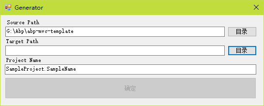

# 模板生成工具

可指定路径及工程名，快速生成基础代码模模板



- source path: 模板工程路径，可在 App.config 中设定默认值

- target path: 生成路径

- project name: 工程名，用以替换模板工程的工程名

App.config 说明

```
<!--模板工程路径-->
<add key="SrcPath" value="G:\Abp\abp-mvc-template"/>
<!--忽略路径-->
<add key="IgnorePaths" value=".git|.vs|bin|obj|packages|logs|node_modules"/>
<!--忽略文件-->
<add key="IgnoreFiles" value=""/>
<!--不进行替换的文件（只复制，不替换文件内容）-->
<add key="SkipFiles" value="exe|zip|rar"/>
<!--模板工程名-->
<add key="DefaultSln" value="MyCompany.MyProject"/>
```
